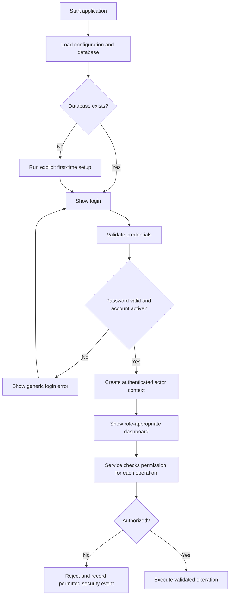
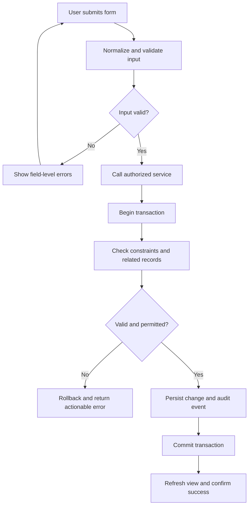
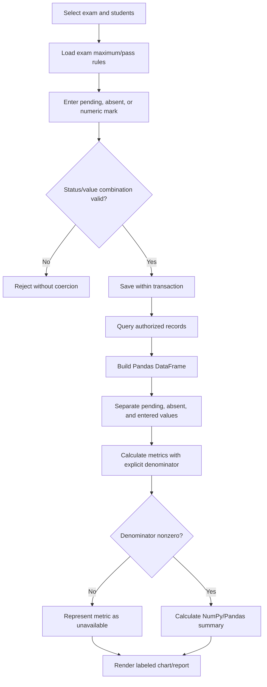

# Workflow Diagrams

## Login and authorization

```mermaid
flowchart TD
    A[Start application] --> B[Load configuration and database]
    B --> C{Database exists?}
    C -- No --> D[Run explicit first-time setup]
    C -- Yes --> E[Show login]
    D --> E
    E --> F[Validate credentials]
    F --> G{Password valid and account active?}
    G -- No --> H[Show generic login error]
    H --> E
    G -- Yes --> I[Create authenticated actor context]
    I --> J[Show role-appropriate dashboard]
    J --> K[Service checks permission for each operation]
    K --> L{Authorized?}
    L -- No --> M[Reject and record permitted security event]
    L -- Yes --> N[Execute validated operation]
```

## Record update

```mermaid
flowchart TD
    A[User submits form] --> B[Normalize and validate input]
    B --> C{Input valid?}
    C -- No --> D[Show field-level errors]
    D --> A
    C -- Yes --> E[Call authorized service]
    E --> F[Begin transaction]
    F --> G[Check constraints and related records]
    G --> H{Valid and permitted?}
    H -- No --> I[Rollback and return actionable error]
    H -- Yes --> J[Persist change and audit event]
    J --> K[Commit transaction]
    K --> L[Refresh view and confirm success]
```

## Marks and analytics

```mermaid
flowchart TD
    A[Select exam and students] --> B[Load exam maximum/pass rules]
    B --> C[Enter pending, absent, or numeric mark]
    C --> D{Status/value combination valid?}
    D -- No --> E[Reject without coercion]
    D -- Yes --> F[Save within transaction]
    F --> G[Query authorized records]
    G --> H[Build Pandas DataFrame]
    H --> I[Separate pending, absent, and entered values]
    I --> J[Calculate metrics with explicit denominator]
    J --> K{Denominator nonzero?}
    K -- No --> L[Represent metric as unavailable]
    K -- Yes --> M[Calculate NumPy/Pandas summary]
    L --> N[Render labeled chart/report]
    M --> N
```